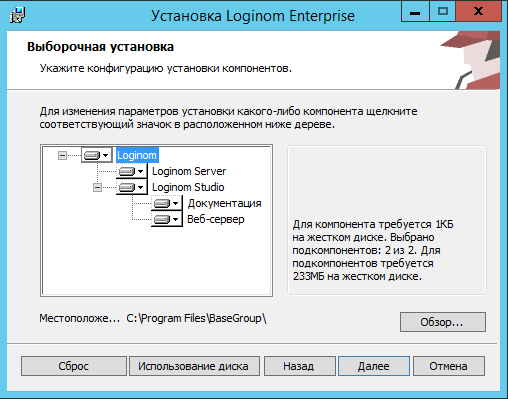
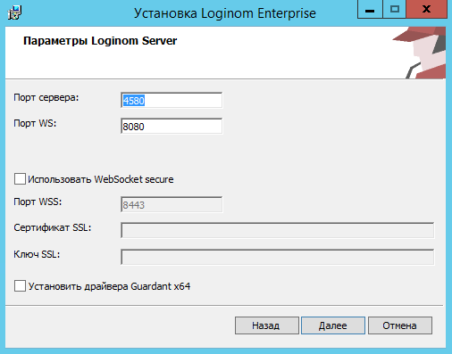
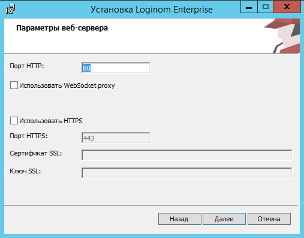
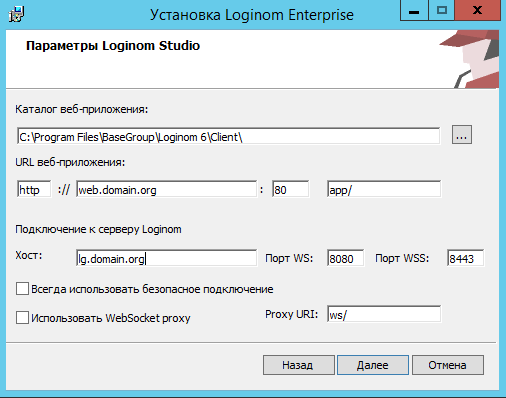

# Установка Loginom Server

## Установка MSI

Варианты имени файла инсталлятора:

* LoginomTeam_6.x.x.msi – инсталлятор для редакции Team
* LoginomStandard_6.x.x.msi – инсталлятор для редакции Standard
* LoginomEnterprise_6.x.x.msi – инсталлятор для редакции Enterprise

где 6.x.x – цифры, обозначающие версию и релиз программы.

Для работы с программой [Loginom Studio](../studio/README.md) (web-интерфейс к Loginom Server)обязательным условием является наличие web-сервера.

Допустимым является использование следующих вариантов web-сервера:

* **Apache** – стандартная установка, web-сервер входит в состав дистрибутива;
* **Microsoft IIS** – не входит в состав дистрибутива, он должен быть [установлен и настроен](./iis.md) отдельно.

Установка Loginom Server при использовании Apache или Microsoft IIS различна. При установке по умолчанию работа Loginom Studio осуществляется через web-сервер Apache.

### Графический интерфейс

#### Запуск инсталлятора

Для установки с нестандартными параметрами в диалоге **Тип установки** нажимаем кнопку **Выборочная**.

#### Выбор компонентов для установки

* **Loginom Server** обязателен для установки *сервера Loginom*.
* **Loginom Studio** устанавливает web-интерфейс.
* **Документация** добавляет в web-интерфейс раздел справки по работе с платформой.
* **Веб-сервер** устанавливает встроенный web-сервер Apache Httpd. Если предполагается использование стороннего web-сервера, компонент должен быть отключен.



> **Примечание:** По умолчанию устанавливаются все компоненты.

#### Параметры Loginom Server

Данный диалог доступен только при установке компонента *Loginom Server*.



* **Порт сервера** — определяет номер порта для подключения Loginom Integrator и BatchLauncher.
* **Порт WS** — определяет номер порта для подключения Loginom Studio по протоколу websocket (ws).
* **Использовать WebSocket secure** — включает возможность задать параметры ssl для websocket:
   * **Порт WSS** — определяет номер порта для подключения Loginom Studio по протоколу websocket secure (wss).
   * **Сертификат SSL**, **Ключ SSL** — полные пути к файлам сертификата и ключа SSL в формате *pem*.
* **Установить драйвера Guardant x64** — запускает установку в автоматическом режиме драйверов для работы электронного ключа защиты.

#### Параметры web-сервера Apache Httpd

Диалог доступен только при установке компонента *Веб-сервер*.



* **Порт HTTP** — определяет номер http порта web-сервера.
* **Использовать WebSocket proxy** — включает проксирование websocket соединений.
* **Использовать HTTPS** — включает возможность задать параметры ssl для http:
   * **Порт HTTPS** — определяет номер https порта web-сервера.
   * **Сертификат SSL**, **Ключ SSL** — полные пути к файлам сертификата и ключа SSL в формате *pem*.

#### Параметры Loginom Studio

Диалог доступен только при установке компонента Loginom Studio без установки компонента Веб-сервер.



* **Каталог веб-приложения**
* **URL веб-приложения**
* **Подключение к серверу Loginom** — содержит параметры для формирования [файла конфигурации Loginom Studio](../studio/config.md)
   * **Хост** — определяет значение параметра [host](../studio/config.md#host). Если значение поля равняется значению host поля *URL веб-приложения*, в `server.json` указывается `host: null`.
   * **Порт WS** и **Порт WSS** — определяют значения параметров [wsport](../studio/config.md#wsport) и [wssport](../studio/config.md#wssport) соответственно.
   * **Всегда использовать безопасное подключение** — включает параметр [secure](../studio/config.md#secure).
   * **Использовать WebSocket proxy** — включает параметр [wsproxy](../studio/config.md#wsproxy).
   * **Proxy URI** — определяет параметр [path](../studio/config.md#path).

### Командная строка

```cmd
msiexec /i "путь_к_msi_файлу" ключи_msi параметры_loginom
```

* `ключи_msi` — допустимые значения можно узнать, выполнив в командной строке `msiexec /?`. Особо полезными могут быть:
   * `/l* "%TEMP%\loginom.msi.log"` — включение журналирования установки.
   * `/qn` — "тихая" установка без отображения графического интерфейса.

%spoiler%Параметры_loginom в виде `КЛЮЧ=значение`%spoiler%

| Ключ | Значение по умолчанию | Описание |
|:--------- |:-------------|:------------- |
| ADDLOCAL | `Server,Studio,Help,Webserver` | Список устанавливаемых компонентов |
| INSTALLDIR | `%ProgramFiles%\BaseGroup` | Каталог установки |
| SERVER_WS_PORT | `8080` | Порт websocket сервера Loginom |
| SERVER_WSS_PORT | `8443` | Порт websocket secure сервера Loginom |
| SERVER_PORT | `4580` | Порт сервера Loginom |
| SERVER_USE_SSL | `0` | Использовать шифрование для websocket (`0,1`) |
| SERVER_KEY_PATH | | Путь к ключу SSL |
| SERVER_CRT_PATH | | Путь к сертификату SSL |
| WEBSRV_PORT | `80` | HTTP порт веб-сервера |
| WEBSRV_PORT_SSL | `443` | HTTPS порт веб-сервера |
| WEBSRV_USE_SSL | `0` | Использовать шифрование (https) (`0,1`) |
| WEBSRV_KEY_PATH | | Путь к ключу SSL |
| WEBSRV_CRT_PATH | | Путь к сертификату SSL |
| WEBAPP_URI | `app/` | URI веб-интерфейса Loginom Studio |
| WEBSRV_USE_WS_PROXY | `0` | Использовать websocket proxy (`0,1`) |
| WEBSRV_PROXY_URI | `ws/` | URI websocket proxy |

%/spoiler%

%spoiler%Примеры%spoiler%

```cmd
:: "тихая" установка Loginom без веб-сервера
msiexec /i ".\LoginomEnterprise.msi" /qn ADDLOCAL=Server,Studio,Help

:: "тихая" установка с нестандартными портами
msiexec /i ".\LoginomEnterprise.msi" /qn WEBSRV_PORT=9080 SERVER_WS_PORT=9081 SERVER_PORT=9082

:: "тихая" установка с включением SSL для websocket
msiexec /i ".\LoginomEnterprise.msi" /qn SERVER_USE_SSL=1 SERVER_KEY_PATH="%ALLUSERSPROFILE%\ssl.key" SERVER_CRT_PATH="%ALLUSERSPROFILE%\ssl.crt"

```

%/spoiler%


## Лицензии

Для запуска службы **LoginomServer** требуется настройка ключей лицензирования (см. [Лицензионные ключи](../licenses/README.md)).

При использовании сервера сетевых ключей требуется создать файл [GnClient.ini](https://dev.guardant.ru/pages/viewpage.action?pageId=1277980) в каталоге `"C:\ProgramData\BaseGroup\Loginom 6\Server"`

## Запуск служб

Службы LoginomServer и LoginomHttpd не запускается после установки автоматически.

При установке продукта в меню "Пуск" Windows (`Все программы\Loginom 6\Server`) добавляются ярлыки **"Запуск сервера Loginom"** и **"Запуск веб-сервера"**.

Для запуска служб с помощью ярлыка требуется выбрать в его контекстном меню пункт **"Запуск от имени администратора"**. При успешном запуске в окне консоли появится надпись `Служба "LoginomServer" успешно запущена`.

Для запуска служб из командной строки требутся выполнить от имени администратора следующие команды:

* Запуск службы "LoginomServer": `net start loginom`
* Запуск службы "LoginomHttpd": `net start httpd_loginom`

## Файрволл

Хост с сервером Loginom должен разрешать подключения:

* Входящие на TCP порт `8080|8443` (websocket) для хостов клиентов (браузеры)
   * при использовании websocket proxy — только для хоста веб-сервера.
* Входящие на TCP порт `4580` для хостов с **Loginom Intergator** или **BatchLauncher**.
* При использовании сетевых ключей Guardant — на TCP/UDP порты `3186` и `3187` хоста сервера сетевых ключей.

Хост с веб-сервером должен разрешать подключения:

* На TCP порт `80|443` (http(s)) для хостов клиентов (браузеры)

Убедитесь, что установленные антивирусы и межсетевые экраны разрешают эти подключения.

%spoiler%Примеры настройки Windows Firewal:%spoiler%

* Разрешаем подключения к http порту web-сервера

```cmd
netsh advfirewall firewall add rule name="Allow HTTP" dir=in action=allow protocol=TCP localport=80
```

* Разрешаем подключения к Loginom Server websocket

```cmd
netsh advfirewall firewall add rule name="Allow Loginom WebSocket" dir=in action=allow protocol=TCP localport=8080
```

* Разрешаем подключения к Loginom Server для Integrator

```cmd
netsh advfirewall firewall add rule name="Allow Loginom Port" dir=in action=allow protocol=TCP localport=4850 remoteip=%lgi_host_ip%
```

* Разрешаем подключения к серверу сетевых ключей для Loginom Server

```cmd
netsh advfirewall firewall add rule name="Allow Guardant Net" dir=out action=allow protocol=TCP remoteport=3186-3187 remoteip=%guardant_net_host_ip%
```

%/spoiler%


## Учетные записи

При установке в Loginom Server создаются учетные записи пользователей:

* `user` с пустым паролем — для работы со сценариями Loginom
* `admin` с паролем `admin` — для администрирования сервера Loginom
* `service` с паролем `service` — для подключения внешних приложений (Integrator и BatchLauncher)

> **Примечание:** После завершения установки в обязательном порядке необходимо изменить пароль учетной записи администратора (admin).


## Проверка работоспособности

* Запустить web-клиент Loginom Studio
   * ярлыком `Все программы\Loginom 6\Studio\Loginom Studio` из меню "Пуск" Windows
   * либо в браузере (рекомендуется Chrome) по URL: `http://localhost/app/`. Если в настройках веб-сервера порт был изменен, то URL: `http://localhost:<Порт HTTP>/app/`
* Авторизоваться с учетной записью `user` с пустым паролем.
